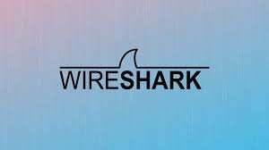
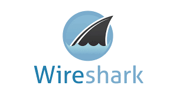

# WireShark_pcapng

В этом репозитории содержатся файлы захвата для анализа и обучения работы в программе Wire Shark. Вы можете использовать их по своему усморению, но, по возможности, оставляйте ссылки на данный репозиторий.

Здесь Вы найдете: `lotsofweЬ.pcapng`, `wrongdissector.pcapng`, `http_google.pcapng`, `download-slow.pcapnq`, `http_espn.pcapng` и другие файлы, которые упоминаются в книге "Анализ пакетов. Практическое руководство по использованию WireShark и tcpdump для решения реальных проблем в локальных сетях." автор: Крис Сандерс. 

P.S. Автор не несет ответственность за данные файлы, т.к. они были найдены на просторах интернета и не все они были лично протестированны владельцем данного репозитория.
